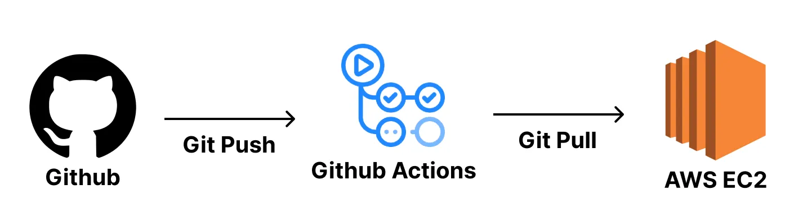

# mungmoong

개요:

언어 : 자바, 스프링 부트  

의존성 :JPA,querydsl,springdata,mail


websocket(stomp) - 진행중


데이터베이스 : mysql 

도구 : redis,docker

==구현내용==  

- 환경설정
1. env파일을 통한 docker 변수 관리
2. application-secret.yml을 통한 application 환경변수 관리
3. 격리 환경 -> local(완료), dev(진행중), prod(진행중)

- 서버구축방안
1. aws ec2 사용
2. redis,rds,아마존 도커허브,s3,

백엔드 배포 flow

[//]: # (Route53&#40;domain 별칭&#41; -> ELB&#40;SSL,TLS-https,80port,443port&#41; ->EC2&#40;80 port&#41; -> EIP -> S3 -> JDK install -> git clone -> build -> RDS)


 


- 뷰 (html,css,js)

thymeleaf,bootstrap 사용 (ssr)

th:replace,th:fragment를 이용하여 중복제거(head,header,footer)

- security

ssr을 사용하므로 session 방식을 채택 

CustomUserDetails,CustomUserDetailsService 구현

- 회원가입

자동 가입 방지하기 위해 email 인증 시 인증번호 생성, redis에 저장(5분) 인증번호를 사용자 메일에 보내어 검증하는 방식 사용 

- 게시판

ckeditor 및 파일 업로드(s3) 사용 , RDS 사용. 
redis로 캐싱하여 조회성능 향상하려 노력하였음.

- JPA

baseTimeentity 사용 . 


article,comment,likedislike...

이중구조로 댓글 표현.
```java
    @ManyToOne(fetch = FetchType.LAZY)
    @JoinColumn(name = "parent_id")
    private Comment parent;

    @OneToMany(mappedBy = "parent")
    private List<Comment> replies = new ArrayList<>();


```

querydsl을 활용한 페이징 처리. 

```java
 QueryResults<Article> results = queryFactory
                .selectFrom(article)
                .where(predicate)
                .offset(pageable.getOffset())
                .limit(pageable.getPageSize())
                .orderBy(article.id.desc())
                .fetchResults();
```

조회 성능 향상을 위한 redis 캐싱 활용
```java
 @Cacheable(cacheNames = "getBoards", 
        key = "'boards:page:' + #pageable.pageNumber + ':size:' + #pageable.pageSize", 
        cacheManager = "boardCacheManager")
```